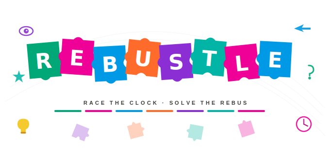
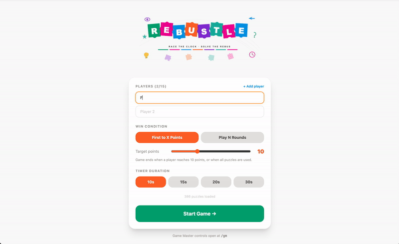
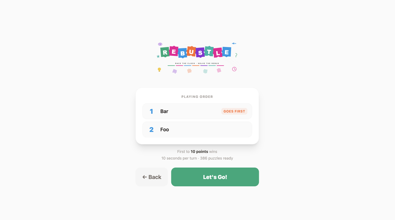
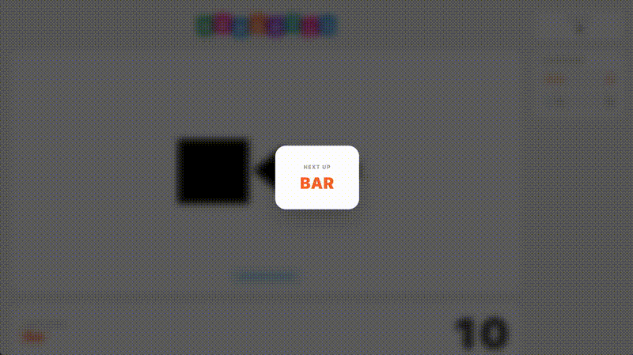
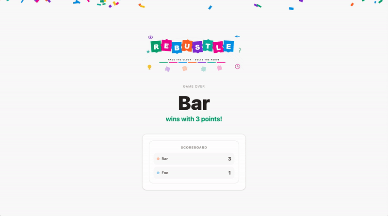

<div align="center">
  
  <p><strong>A rebus puzzle party game for groups of 2–15 players.</strong></p>
</div>

---

## What is Rebustle?

Rebustle is a browser-based party game where a **Game Master** hosts a session and players take turns solving rebus puzzles — pictures that represent words, phrases, movies, songs, and more. No app install required; just open two browser windows.

386 puzzles across 11 categories: Common Phrase, Thing, Food, Movie, Music, Sport, Christmas Movie, Word, Place, Person, and Song.

---

## How to Play

### Setup

Rebustle uses two browser windows — one for the **Game Master (host)** and one displayed on a shared screen for everyone to see (a TV, projector, or second monitor).

| Window | URL | Who sees it |
|--------|-----|-------------|
| Game Master | `/gm` | Host only |
| Game screen | `/` | Everyone (put this on the big screen) |

> **Note:** Both windows must be open in the **same browser** on the same machine. The two screens communicate via the [BroadcastChannel API](https://developer.mozilla.org/en-US/docs/Web/API/BroadcastChannel), which only works within a single browser session.

---

### Step 1 — Configure the game

The Game Master opens `/gm` and is taken to the setup screen.



- Add **2–15 players** by name.
- Choose a **win condition**:
  - **First to X Points** — game ends the moment a player hits the target (3–25 pts).
  - **Play N Rounds** — play a fixed number of rounds (2–15), highest score wins.
- Choose a **timer duration** — 10s, 15s, 20s, or 30s per turn.
- Hit **Start Game** — player order is shuffled randomly.

---

### Step 2 — Player order screen

Before the first round starts, both screens show the randomised turn order so everyone can see who goes first.



The GM clicks **Let's Go** to begin.

---

### Step 3 — Gameplay

Each round, players take turns attempting the current puzzle.



**Game screen (players see this):**
- The rebus puzzle image and its category clue (e.g. *Common Phrase*, *Movie*).
- The current player's name and a countdown timer (duration set at game setup).
- A live scoreboard on the right.
- Sound effects: a **ding** when a correct answer is given, a **buzz** when the timer runs out, and **ticking** when the timer hits 3 seconds.

**GM screen (host sees this):**
- The same puzzle — plus the **answer** is always visible to the GM.
- An indicator showing how many players have attempted the current puzzle this round.
- Three controls:

| Control | When available | What it does |
|---------|---------------|--------------|
| **Correct ✓** | Any time | Awards 1 point, flashes the answer, moves to the next puzzle (timer resets for the same player) |
| **Skip →** | Any time | Flashes the answer, moves to the next puzzle — **same player keeps their remaining time** |
| **⏸ Pause** | Any time | Freezes the timer; both screens show a pause overlay |

> When the timer expires, the turn automatically passes to the next player on the **same puzzle**. Once all players have had a turn, the GM can Skip to move on.

---

### Step 4 — Winning

The game ends when the win condition is met (points target reached or rounds completed). The winner screen shows the final leaderboard with medals and a confetti celebration.



- **Play Again** — starts a new game with the same players and settings instantly.
- **Reset Players** — goes back to the setup screen.

---

## Running Locally

```bash
git clone https://github.com/your-username/rebustle.git
cd rebustle
npm install
npm run dev
```

Then open:
- **[http://localhost:5173/](http://localhost:5173/)** — game screen (put on the big screen)
- **[http://localhost:5173/gm](http://localhost:5173/gm)** — Game Master controls

To build for production:

```bash
npm run build       # outputs to dist/
npm run preview     # preview the production build locally
```

The app is a fully static SPA — drop the `dist/` folder on any static host (Vercel, Netlify, GitHub Pages, etc.).

---

## Puzzle Categories

| Category | Count |
|----------|------:|
| Common Phrase | 207 |
| Thing | 40 |
| Food | 31 |
| Music | 29 |
| Movie | 28 |
| Sport | 12 |
| Christmas Movie | 11 |
| Word | 10 |
| Place | 8 |
| Person | 8 |
| Song | 2 |

Puzzles are shuffled randomly at the start of each game so no two games play the same way.

---

## Tech Stack

- **React 19** + **TypeScript**
- **Vite** for bundling
- **Tailwind CSS v4** for styling
- **BroadcastChannel API** for GM ↔ game screen sync (no server required)
- **Web Audio API** for sound effects (no library, fully client-side)
- **Vitest** for unit tests

---

## Puzzle Credits

All puzzle images are sourced from [JustFamilyFun.com](https://justfamilyfun.com/). Full credit and thanks to them for the fantastic rebus puzzle content.
